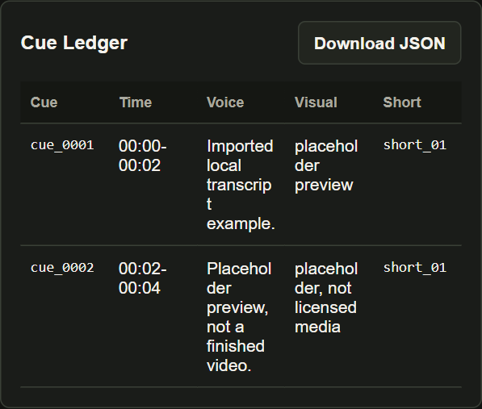

# Video Pipeline

Build review files from a script or an imported transcript.

**Script/transcript → cue ledger → asset manifest → subtitles/preview → review → upload package.**

This is a local prototype. Without supplied media, the preview uses placeholder
frames. The package contains upload instructions; it does not upload or
publish to YouTube.

[Run locally](#run-locally) · [Review flow](#review-flow) · [Transcript import](#external-asr-import)



*Real Cue Ledger after importing a local two-segment SRT. Each segment has a start time, end time, and subtitle text. The preview uses placeholders; media rights and publishing remain unapproved.*

In this sample, **00:00–00:02** contains “Imported local transcript example.” The next cue, **00:02–00:04**, contains “Placeholder preview, not a finished video.” These timings are written to `subtitles.srt` and `cue_ledger.json`.

The inspectable outputs are `cue_ledger.json`, `asset_manifest.json`,
`subtitles.srt`, `preview.mp4` and `upload_package.md`. Review status and asset
rights are separate gates; an existing package file does not mean upload
approval. Web review uses JSON files, while the project API uses PostgreSQL;
these paths do not yet share one review store.

## Run locally

Use Docker Compose with ports 5432, 6379, and 8010 free. For the offline demo, keep provider keys empty and do not add a secrets file.

```powershell
git clone https://github.com/SpadesZ/video-pipeline.git
cd video-pipeline
Copy-Item .env.example .env
docker compose up -d --build
docker compose run --rm api python scripts/smoke_test.py
docker compose run --rm api python scripts/check_json_roundtrip.py
```

Open `http://localhost:8010/` and submit a short sample script. The console saves project files under `data/projects/<project_id>/`. Imported SRT, VTT, JSON, or text can replace rough script timing. Without supplied media, the MP4 uses placeholder frames.

## Verification scope

**2026-10-02 final batch:** reused the existing isolated API image with this
checkout mounted; no fresh build was run. Smoke artifacts, API create/read
through PostgreSQL, web project creation, two-segment SRT import and JSON
nested-type/invalid-data checks passed. FFprobe confirmed a 4.04-second H.264
placeholder preview at 1280×720; this is file/render verification, not final
video-quality acceptance. The real Cue Ledger was recaptured.

The worker stayed stopped. No asynchronous provider task, local ASR accuracy,
licensed-media quality, upload or publishing was tested. SRT/VTT/JSON/text
import exists in code; this review exercised SRT only. API and web persistence
were checked as separate paths, not as a unified review system.

<details>
<summary>Earlier presentation-check record</summary>

The earlier check recorded a fresh API image build, smoke artifacts, API
project create/read through PostgreSQL, web project creation, two-segment SRT
import, a placeholder MP4 and browser rendering. JSON checks verified nested
types and rejected invalid nested data. Worker dependencies used an existing
image; asynchronous provider tasks, real ASR, licensed media and publishing
were not checked. This is the earlier record, not a new build in the final batch.

</details>

## Technical details

The original scope and operating notes follow, with completed import work and partial database support corrected.

### MVP scope

CPU-first Docker scaffold for a semi-automated video production pipeline.

The MVP target is intentionally narrow:

```text
approved script + optional voice/transcript
  -> cue_ledger.json
  -> asset_manifest.json
  -> subtitles.srt
  -> placeholder preview.mp4 when FFmpeg is available
  -> upload_package.md
```

## Why CPU-first

This project does not assume a local GPU. The default `ASR_PROVIDER=import`
accepts imported transcript segments, or falls back to rough script-derived cues.
WhisperX/CUDA can be added later behind the same adapter interface.

## Services

- `api`: FastAPI control plane.
- `worker`: Celery worker for long-running pipeline jobs.
- `redis`: Celery broker and result backend.
- `postgres`: SQLModel project persistence is used by the JSON API and smoke job. Web-console review state still uses project JSON files; a shared review store is not complete.

## Quick Start

```powershell
Copy-Item .env.example .env
docker compose up --build
```

Open the console:

```text
http://localhost:8010/
```

Manual start/stop scripts:

```powershell
scripts/start.ps1
scripts/health.ps1
scripts/stop.ps1
```

Windows startup automation is intentionally not enabled.

Secrets:

```powershell
Copy-Item secrets/.env.local.example secrets/.env.local
```

Paste provider keys into `secrets/.env.local` when LLM tasks need live calls.

Health check:

```text
http://localhost:8010/health
```

Run a smoke job:

```powershell
docker compose run --rm api python scripts/smoke_test.py
```

Outputs land under:

```text
data/projects/<project_id>/
```

## Review Flow

Projects move through:

```text
cues_ready -> assets_review -> preview_ready -> approved
```

At any point, use `Request Changes` to move the project to `changes_requested`.
`Upload Ready` is only true when the final preview is approved and every asset
has `approved` rights status.

## External ASR Import

Use the project detail page's `Import Transcript` panel to paste external ASR
output. Supported formats:

```text
SRT / VTT / JSON / Text
```

Importing a transcript rebuilds `cue_ledger.json`, `subtitles.srt`,
`preview.mp4`, `asset_manifest.json`, and the visual quality contract, then
returns review status to `cues_ready`.

## Next Build Steps

1. SRT/VTT/JSON/text import is implemented. Improve import validation and source traceability; imported timing is not proof of local ASR accuracy.
2. Replace rough cue timing with CPU-friendly faster-whisper output.
3. Unify web-console review state with API database persistence; the current paths use different stores.
4. Add YouTube analytics CSV import for 24h, 7d, and 28d decisions.
5. Add optional GPU/WhisperX profile only after the CPU workflow is stable.
